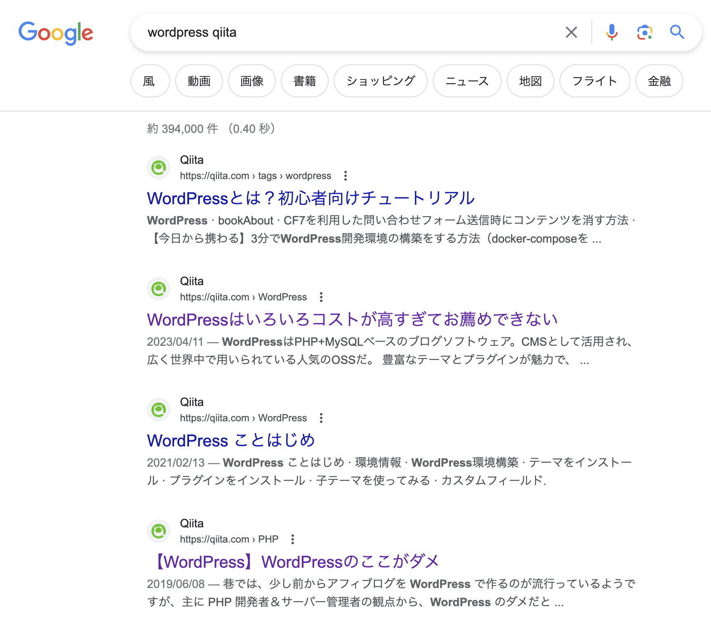
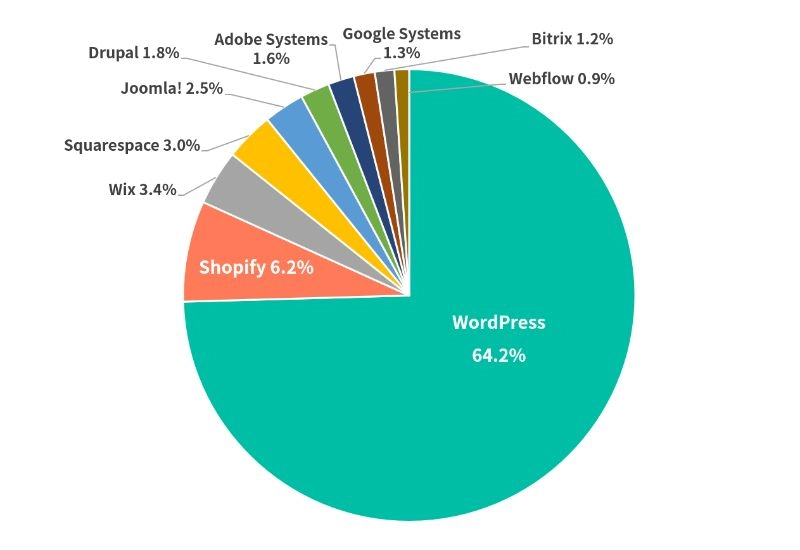

# 最強のオレオレWordPress開発環境
## n13u ( @\_n13u\_ )

---

# 自己紹介

## n13u / 西村航

札幌の事業会社SocialChangeLab合同会社（[@scl_2022](htt)）で副代表兼CTOをしながら未完Foundation（@mikan_prj）でU25向けの勉強会を開催したり企画したりしています。
エンジニアとしては、Web系を中心に触ることがほとんどですが、趣味でUnityや3DCG周りも触っています。
  

Twitter [@\_n13u\_](https://twitter.com/_n13u_)

---

# 今日話すこと

会社でウェブ制作の受託やちょっとしたWordPressプラグイン開発などで、３〜４年触ってきた中でオレオレなWordPress開発環境を見つけたので、それをシェアしたい！という試みです。

---

# みなさんWordPressって知ってますか？

---

# ~~悪名高き~~ シェア率No.1 のCMS

「WordPress Qiita」とかで検索するとすごいことになっていますが、シェア世界一のCMS（コンテンツ管理システム）です

---

# 個人的にはこれからも使っていきたい！と思っている

- WordPress 5.8 あたりから追加されたブロックテーマでJSXが書ける
- SNS API連携などちょっと複雑なことをCMSでしたい時に最適（代替なさそう）
- ブログシステムやサービスはいろいろあるけど、CSS/JSを使っていくらでもリッチにできる
- 最悪ヘッドレスCMSとしても使える
- PHPにより生み出された（バグや脆弱性も含む）無限の可能性　etc...

---

# 逆にWordPressがよくないと思っているところ

- 開発環境構築が面倒
  - Local by Flywheel とか Xamppとかあるけど、環境汚れるので好みじゃない。PHPバージョンが管理されていないまま放置されているのも好きじゃない...
  - 生のJSとCSS、PHPだけで書くのは正直キツい。特にJS周りはマジでしんどい
  - テンプレート
- セキュリティの問題
  - ここできないなら使わない方がいい。対処法はいろいろ公開されているので、プロに聞こう

---

# とはいいつつ使い続けたい...

「そうだ、開発環境自作しよう」

---

# JavaScript周り

[WordPress/gutenberg](https://github.com/WordPress/gutenberg)を中心とした公式JavaScriptパッケージ群で解決。

- `@wordpress/env`が提供する`wp-env`コマンドを使うことでDocker環境が立てられる
  - テーマ・プラグイン用開発フォルダのマウント、事前のプラグインインストールも可能に
- `@wordpress/api-fetch`でWordPressのAPIにアクセス可能。Typescriptによる型ガード付
  - パーマリンク設定などは必要
- `@wordpress/component`で管理画面のボタンなどUIコンポーネントが利用可能（Storybookもあります）

---

# JavaScript + CSS のバンドル

CSSは直で書きたくないのでSass(Scss)を書いています。JSもTypescript+tsxで書きます。問題はバンドラー

-  `@wordpress/scripts`が提供する`wp-scripts`コマンドでビルドは可能
   -  ビルドツールがwebpackなのでめちゃくちゃ遅い。
   -  esbuildとか使えなくもないけど、wordpressのブロックテーマやAPIなどにアクセスするため依存関係を解決するプラグインが存在しない（と思う。１年半前くらいの話です）
   -  個人的にはviteとかesbuildとかでバンドルしちゃいたい。なんならブロックテーマとかも扱いたい

---

# どうしよう...

「そうだ、esbuildプラグイン自作しよう」

---

# つくりました

が、パッケージとして公開までいかず＋細かい調整を都度ローカルの開発環境にコードをコピペして使ってます

[esbuild-gutenberg-dependency-extract-plugin](https://github.com/WataruNishimura/esbuild-gutenberg-dependency-extract-plugin)

## やってること
- ES Moduleで表記されているパッケージ名をJSのグローバル変数に置き換える（！？）
例）@wordpress/components→wp.components
- ビルド時に `[entry_name].asset.php` を出力しWordPress側に依存パッケージを伝える

--- 

# PHP周り

テンプレートの知識わからん、全部functions.phpに書く？プラグインを都度自作する？

- プラグインの個別開発は管理コストが増えるだけ（WordPressの標準関数にプラグインのインストールができるものがない）
- functions.phpの肥大化はさけたい
- MVCライクにかけないだろうか。。。。。

---

# どうしよう

「そうだ、フレームワーク自作しよう」

---

# 結論：先人の知恵をお借りしました

「 **[WordPressテーマでMVCモデルを実現する](http://wordpress.ad5.jp/column/mvc-model-in-wordpress-theme/)**」

サンプルコードもしっかりまとまっており、かつPHPをうまく使いこなしている感じのプログラムで非常に重宝しております…

PHPって `new $class` とかできちゃうんですね… すごい… ~~こわい…~~

---

# デプロイ面倒〜

- GitHubでmainブランチにマージされたらビルドしてくれないかな〜〜
- そのためにPHP書くのはしんどいし〜
- プラグインもあるけど有料だし〜

---
# どうしよう

「そうだ、GitHub Actions書こう」

---

# 書きました

[WordPress Auto Deployment GitHub Actions Script](https://gist.github.com/WataruNishimura/1f77e1782b252bb03be254ac2cc217cc)

FTPでデプロイするだけのシンプルなものです。ビルドして環境フォルダごとテーマフォルダとかプラグインフォルダにお送りします。
そのためのexclude...

---

# 最後に

WordPress個人的には大好きですが、若干燃えがちなテーマでもあるので、これを機にみなさんが楽しくWordPressライフを送れるきっかけになれば嬉しいです！

よければ各種Twitterフォローよろしくお願いします！